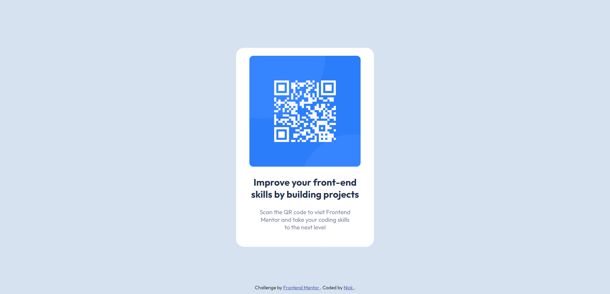

# Frontend Mentor - QR code component solution

This is a solution to the [QR code component challenge on Frontend Mentor](https://www.frontendmentor.io/challenges/qr-code-component-iux_sIO_H). Frontend Mentor challenges help you improve your coding skills by building realistic projects. 

## Table of contents

- [Frontend Mentor - QR code component solution](#frontend-mentor---qr-code-component-solution)
  - [Table of contents](#table-of-contents)
  - [Overview](#overview)
- [Screenshot](#screenshot)
  - [Desktop:](#desktop)
  - [Mobile:](#mobile)
    - [Links](#links)
  - [My process](#my-process)
    - [Built with](#built-with)
    - [What I learned](#what-i-learned)
  - [Author](#author)

## Overview

# Screenshot

## Desktop:

## Mobile:

### Links

- Solution URL: [Solution](https://www.frontendmentor.io/solutions/qrcodecomponent-solution-using-flexbox-lLzWCYfRJc)
- Live Site URL: [Site](https://fitsos17.github.io/qr-code-component/)

## My process

### Built with

- Flexbox

### What I learned

What I learn from this challenge is: 
  - Use css flexbox better
  - Use sublime text (code editor)
  - Write markdown

## Author

- Frontend Mentor - [@Fitsos17](https://www.frontendmentor.io/profile/Fitsos17)
- Github - [Fitsos17](https://github.com/Fitsos17)
- Twitter - [@AmridisNikolas](https://twitter.com/AmiridisNikolas)

Thank you for checking out my solution. If you liked it, consider leaving a like on the solution's page and follow me on my social media :D
